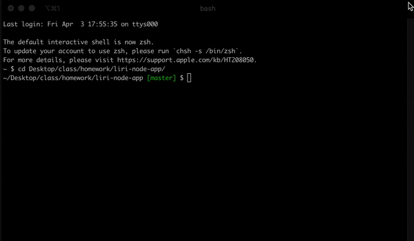

# LIRI Node App 

LIRI (Language Interpretation and Recognition Interface) is a command line nodeJS app created to accept a search command and parameter and will return relevant data.

## Description

LIRI will search the Bands in Town, OMDB and Spotify APIs based on the command and parameter provided. Some basic information will be returned in the console. The information will also be logged in the log.txt file.

LIRI will accept the following commands:
* concert-this
* movie-this
* spotify-this-song
* do-what-it-says

## How to use

**`node liri.js concert-this <artist/band name here>`**  
This will search the Bands in Town API and return 4 concerts for the artist/band entered. (Uses the Axios package to get data from Bands in Town

Each item will include the following information:
* Artist/band requested
* Name of the venue
* City and region of the concert
* The date of the concert

If the user does not enter a song name LIRI will use Tool.

**`node liri.js spotify-this-song <song name here>`**  
This will search the Spotify API and return 4 results for the song name entered. (Uses the Spotify package to get data from Spotify)

Each item will include the following information: 
* Artist(s)
* The song's name
* A preview link of the song from Spotify
* The album that the song is from

If the user does not enter a song name LIRI will use "The Sign" by Ace of Base.

**`node liri.js movie-this <movie name here>`**  
This will search the OMDB API and return data on the movie entered. (Uses the Axios package to get data from OMDB)

The results will include the following information:
* Title of the movie
* Year the movie came out
* IMBD Rating of the movie
* Rotten Tomatoes Rating of the Movie
* Country where the movie was produced
* Language(s) of the movie
* Plot of the movie
* Actors in the movie

If the user does not enter a song name LIRI will use Mr. Nobody

**`node liri.js do-what-it-says`**  
This will run one of the previous searches and give back results for a predetermined search parameter. This command will look in the random.txt file for command and search to execute.

## Tech used

-   Visual Studio
-   JavaScript
-   Node.js
-   [Axios](https://www.npmjs.com/package/axios)
-   [Moment](https://www.npmjs.com/package/moment)
-   [DotEnv](https://www.npmjs.com/package/dotenv)

## APIs used

-   [Node-Spotify-API](https://www.npmjs.com/package/node-spotify-api)
-   [OMDB API](http://www.omdbapi.com)
-   [Bands In Town API](http://www.artists.bandsintown.com/bandsintown-api)

## Role in App Development
LIRI was created from create scratch by one developer.
